# Danny's-Diner--Case-Study-1-- 🧑‍💼

[Link to dataset, #8weeksofsqlchallenge](https://8weeksqlchallenge.com/case-study-1/)
------
# Introduction
Danny seriously loves Japanese food so in the beginning of 2021, he decides to embark upon a risky venture and opens up a cute little restaurant that sells his 3 favourite foods: sushi, curry and ramen.

Danny’s Diner is in need of your assistance to help the restaurant stay afloat - the restaurant has captured some very basic data from their few months of operation but have no idea how to use their data to help them run the business.

# Problem Statement
Danny wants to use the data to answer a few simple questions about his customers, especially about their visiting patterns, how much money they’ve spent and also which menu items are their favourite. Having this deeper connection with his customers will help him deliver a better and more personalised experience for his loyal customers.

He plans on using these insights to help him decide whether he should expand the existing customer loyalty program - additionally he needs help to generate some basic datasets so his team can easily inspect the data without needing to use SQL.

Danny has provided you with a sample of his overall customer data due to privacy issues - but he hopes that these examples are enough for you to write fully functioning SQL queries to help him answer his questions!

Danny has shared with you 3 key datasets for this case study:
- sales
- menu
- members

You can inspect the entity relationship diagram and example data below.

# Entity Relationship Diagram
   
-----

# Case Study Questions
_Each of the following case study questions can be answered using a single SQL statement:_

- What is the total amount each customer spent at the restaurant?
- How many days has each customer visited the restaurant?
- What was the first item from the menu purchased by each customer?
- What is the most purchased item on the menu and how many times was it purchased by all customers?
- Which item was the most popular for each customer?
- Which item was purchased first by the customer after they became a member?
- Which item was purchased just before the customer became a member?
- What is the total items and amount spent for each member before they became a member?
- If each $1 spent equates to 10 points and sushi has a 2x points multiplier - how many points would each customer have?
- In the first week after a customer joins the program (including their join date) they earn 2x points on all items, not just sushi - how many points do customer A and B have at the end of January?

# Answer the case study question
- What is the total amount each customer spent at the restaurant?

  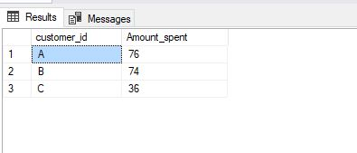
  
                      SELECT customer_id, sum(price) as Amount_spent
                        FROM sales s

                           Full join menu m
                           on s.product_id = m.product_id

                           Group by customer_id

- How many days has each customer visited the restaurant?

  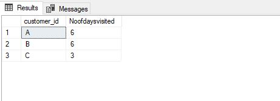
  
                  SELECT customer_id, COUNT(order_date) as Noofdaysvisited
                     FROM sales

                     GROUP BY customer_id
                     
- What was the first item from the menu purchased by each customer?
  
  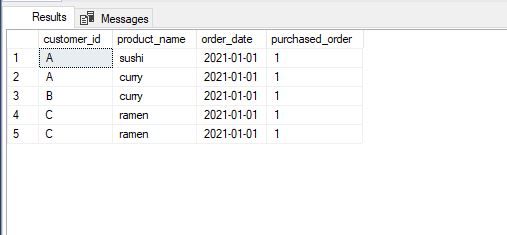
  
                  WITH ranked AS (SELECT customer_id, product_name, order_date,
                     RANK () OVER (PARTITION BY customer_id order by order_date) as purchased_order
                     FROM sales s 

                     join menu m
                     on s.product_id = m.product_id
                     )

                     SELECT * from ranked 
                     where purchased_order = 1
  
- What is the most purchased item on the menu and how many times was it purchased by all customers?
  | most purchased item  | Number of times purchases by all customers |
  |:--------------------:|:--------------------:|
  | 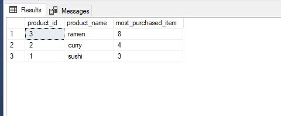          | 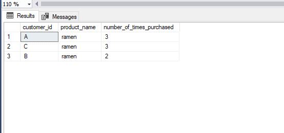 |
  
                       SELECT  s.product_id, product_name, count(product_name) as most_purchased_item
                     FROM sales s

                     Inner Join menu m
                     on s.product_id = m. product_id

                     group by product_name, 
                           s.product_id

                     order by most_purchased_item DESC

                     -- and how many times was it purchased by all customers?
                     SELECT  customer_id, product_name, count(product_name) as number_of_times_purchased
                     FROM sales s
                     Inner Join menu m
                     on s.product_id = m. product_id

                     where product_name like '%ramen'
                     group by product_name, 
                           s.customer_id

                     order by number_of_times_purchased DESC
  
- Which item was the most popular for each customer?

   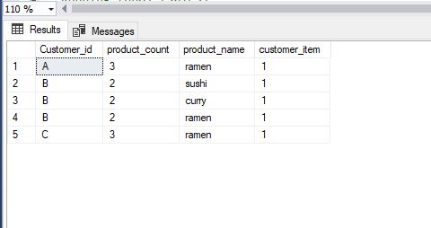   

               WITH ranked_customter AS (
               SELECT s.Customer_id, count(s.product_id) as product_count, product_name, 
               RANK () OVER (PARTITION  BY customer_id order by COUNT(S.product_id) desc) as customer_item
               FROM sales s

               Inner Join menu m
               on s.product_id = m.product_id

               GROUP BY S.product_id, customer_id, product_name)

               SELECT * FROM ranked_customter
               WHERE customer_item = 1

- Which item was purchased first by the customer after they became a member?

  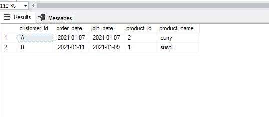   
  
                 SELECT s.customer_id, order_date, join_date, s.product_id, product_name  
               FROM sales s 

               inner join members me
               on s.customer_id = me.customer_id

               inner join menu m
               on s.product_id = m.product_id

               where order_date ='2021-01-07' and s.customer_id = 'A'
               OR order_date = '2021-01-11' and s.customer_id = 'B'

               ORDER BY customer_id 
  
- Which item was purchased just before the customer became a member?

  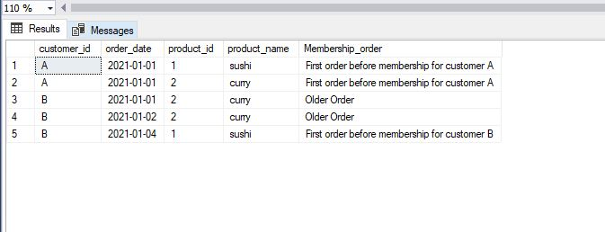  
  
               SELECT me.customer_id, order_date, s.product_id, m.product_name, 
                  case when order_date = '2021-01-01' and s.customer_id = 'A' then 'First order before membership for customer A' 
                     when order_date = '2021-01-04' and s.customer_id = 'B'  then 'First order before membership for customer B'
                     else 'Older Order' end as 'Membership_order'
                  FROM members me

                  inner join sales s
                  on me.customer_id = s.customer_id

                  inner join menu m
                  on s.product_id = m.product_id

                  where order_date < '2021-01-07'
  
  
  
- What is the total items and amount spent for each member before they became a member?

   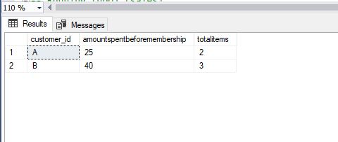   
   
                     SELECT s.customer_id, sum(price) As amountspentbeforemembership, count(order_date) As totalitems
                  FROM sales s   

                  inner join menu m
                  on s.product_id = m.product_id 

                  inner join members me
                  on s.customer_id = me.customer_id

                  where order_date   < '2021-01-07'

                  GROUP BY S.customer_id
   
- If each $1 spent equates to 10 points and sushi has a 2x points multiplier - how many points would each customer have?

  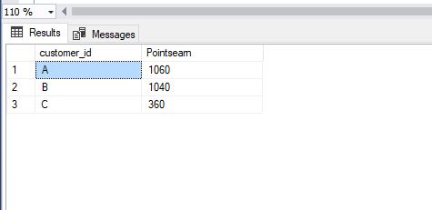   
  
                    SELECT s.customer_id, 
                  sum(
                  case when s.product_id = 1 and price = 10 then price * 10
                      when s.product_id = 2 and price = 15 then price * 20
                      when s.product_id = 3 and price = 12 then price * 10
                      else 'no points' end) as Pointsearn
                  FROM sales s

                  full join menu m
                  on s.product_id = m.product_id

                  GROUP BY  s.customer_id
  
- In the first week after a customer joins the program (including their join date) they earn 2x points on all items, not just sushi - how many points do customer A and B have at the end of January?

  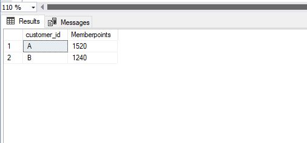   

            SELECT s.customer_id, 
               sum(
               case when s.customer_id = 'A' or s.customer_id = 'B' then  price  * 20
                  else price * 1 end) as Memberpoints
               FROM sales s

               inner join menu m
               on s.product_id = m.product_id 

               inner join members me
               on s.customer_id = me.customer_id

               where order_date < '2021-01-31'
               group by s.customer_id
 ------------
 
# Bonus Questions
- _Join All The Things_
The following questions are related creating basic data tables that Danny and his team can use to quickly derive insights without needing to join the underlying tables using SQL.

   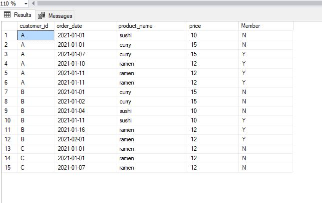
   
                  SELECT s.customer_id, order_date, product_name, price,
                  case when order_date >= join_date then  'Y'
                  else 'N' end as Member
                  FROM sales s

                  inner join menu m
                  on s.product_id = m.product_id 

                  full join members me
                  on s.customer_id = me.customer_id

- _Rank All The Things_
Danny also requires further information about the ranking of customer products, but he purposely does not need the ranking for non-member purchases so he expects null ranking values for the records when customers are not yet part of the loyalty program. 

   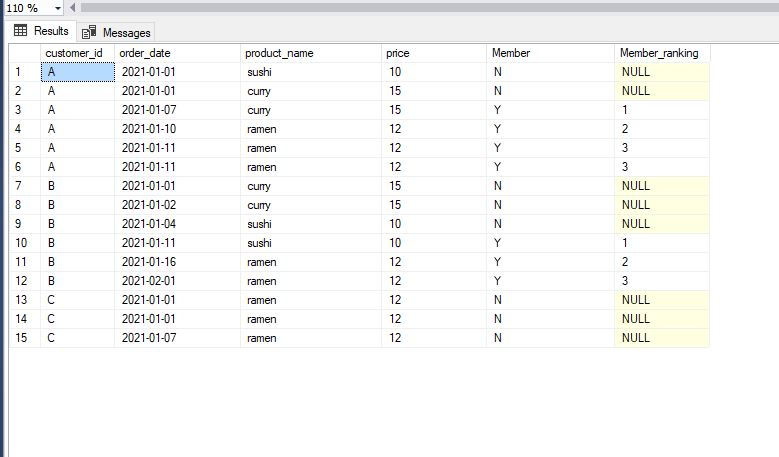
   
                  WITH membership_table_ranking as
                  (
                  SELECT s.customer_id, order_date, product_name, price,
                  case when order_date >= join_date then  'Y'
                     else 'N' end as Member
                  FROM sales s 

                  inner join menu m
                  on s.product_id = m.product_id 

                  full join members me
                  on s.customer_id = me.customer_id
                  ) 

                  SELECT *, 
                  CASE WHEN Member = 'N' THEN NULL
                      WHEN MEMBER = 'Y' THEN RANK () OVER (PARTITION BY customer_id, Member order by order_date)
                      else 0 end  as Member_ranking 
                  FROM  membership_table_ranking 

# Conclusion 
   Being part of this **#8WeekSQLChallenge** by Danny has made me master so SQL syntax and critical thing and research on how somethings can be done. A big thank you to [Theoyinbooke](https://twitter.com/TheOyinbooke) someone I regard to as a mentor for indirectly teaching me SQL and to [Danny](https://8weeksqlchallenge.com/) for organizing this challenge to allow me sharpen my sql skill. Though, I'm still a work in progress and with dedication, i will perfect my sql skills. 🥰
   

